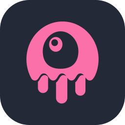

<div align="center">


<a href="https://github.com/ryuki0724">
  
</a>

<p>
  <a href="mailto:yoshida122121@gmail.com">
    
  </a>
  <a href="https://github.com/ryuki0724">
    
  </a>
  
</p>

</div>

## About Me

```yaml
name:       Yoshida Ryuki
role:       Software Engineer (Web & Mobile)
building:   full-stack web apps with Laravel, cross-platform mobile apps with Flutter
exploring:  Go, AI/LLM integration
learning:   how to become a billionaire (still figuring out how)
ask-me:     anything, I'll Claude it with confidence
contact:    yoshida122121@gmail.com
```

## Tech Stack

<div align="center">

<table>
  <tr>
    <td align="right"><b>Backend</b></td>
    <td></td>
  </tr>
  <tr>
    <td align="right"><b>Frontend</b></td>
    <td>&nbsp;</td>
  </tr>
  <tr>
    <td align="right"><b>Mobile</b></td>
    <td></td>
  </tr>
  <tr>
    <td align="right"><b>Data & Cloud</b></td>
    <td></td>
  </tr>
</table>

</div>

## Contribution Graph

<div align="center">

<picture>
  <source media="(prefers-color-scheme: dark)" srcset="./profile/snake-dark.svg" />
  <source media="(prefers-color-scheme: light)" srcset="./profile/snake.svg" />
  
</picture>

</div>

## Let's Build Something

> Most of my work lives in **private company repositories**, so my public footprint is light for now.

I enjoy turning ideas into shipped products, from the backend all the way to the app in users' hands. If you have something in mind, I'd love to hear about it and build it together.

**Happy to jam on**

- **Web platforms**: customer-facing sites and the admin tools behind them
- **Mobile apps**: iOS and Android apps people use every day
- **AI features**: putting LLMs to work in real products
- **Real-time experiences**: chat, live updates, anything that should feel instant

<a href="mailto:yoshida122121@gmail.com">
  
</a>

<!--
  新增開源專案時，複製下面這行並把 REPO_NAME 換成 repo 名稱即可（主題已對齊 tokyonight）：
  [](https://github.com/ryuki0724/REPO_NAME)
-->

<div align="center">

<i>Thanks for stopping by, feel free to reach out!</i>


</div>
