<div align="center">

<a href="https://github.com/ryuki0724">
  
</a>

<p>
  <a href="mailto:yoshida122121@gmail.com">
    
  </a>
  <a href="https://github.com/ryuki0724">
    
  </a>
  
</p>

</div>

---

## About Me

```yaml
name:     Yoshida Ryuki
role:     Software Engineer (Web & Mobile)
building: full-stack web apps · cross-platform mobile apps
learning: how to become a billionaire 💰 (still figuring out how)
ask-me:   anything — I'll Claude it with confidence 🤖
contact:  yoshida122121@gmail.com
```

- 💼 Software Engineer specializing in **Web & Mobile Application Development**
- 🔭 Shipping full-stack web apps with **Laravel** and cross-platform mobile apps with **Flutter**
- 🌱 Exploring **Go**, **AI/LLM integration**, and **real-time WebSocket systems**

## Tech Stack

<div align="center">


<br />


</div>

## GitHub Stats

<div align="center">




<!--
  貪食蛇貢獻動畫 (snake animation)
  需先在 .github/workflows/grs.yml 加入 snake 產生步驟（見對話中提供的片段），
  workflow 跑過一次、profile/snake.svg 與 snake-dark.svg 產生後，
  取消下面這段註解即可啟用（會依系統深淺色自動切換）：

  <br /><br />
  <picture>
    <source media="(prefers-color-scheme: dark)" srcset="./profile/snake-dark.svg" />
    <source media="(prefers-color-scheme: light)" srcset="./profile/snake.svg" />
    
  </picture>
-->

</div>

## Featured Projects

> Most of my work lives in **private company repositories**, so my public footprint is light for now.
> Open-source projects are on the way — this section will grow over time.

<!--
  新增開源專案時，複製下面這行並把 REPO_NAME 換成 repo 名稱即可（主題已對齊 tokyonight）：
  [](https://github.com/ryuki0724/REPO_NAME)
-->

---

<div align="center">
  <i>Thanks for stopping by — feel free to reach out!</i>
</div>
